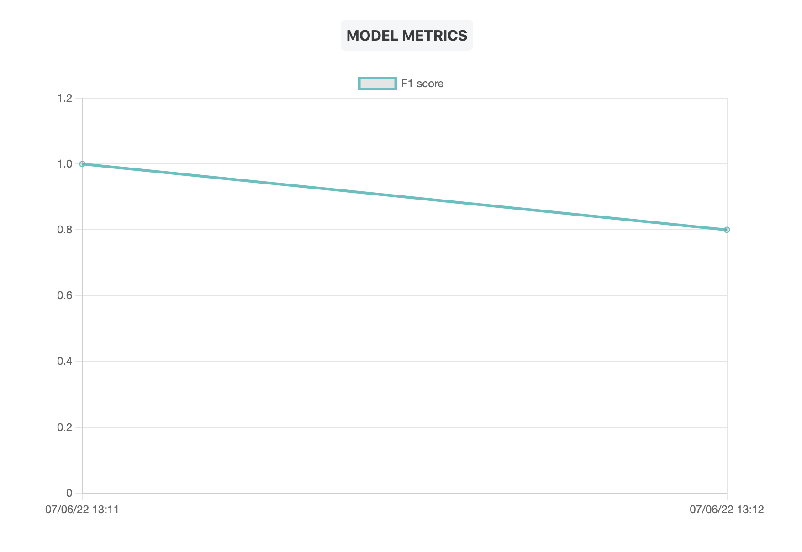

# ML Model monitoring with Toloka

This project demonstrates how to do human-in-the-loop ML model monitoring using Toloka.



# Running the demo project

0. Download model checkpoint:
```
curl -o models/model.ckpt 'https://tlk.s3.yandex.net/research/toloka_monitoring/model.ckpt'
```
1. `pip install -e .`
2. Create config file from template:
```
cp toloka_monitoring/_template_config.py toloka_monitoring/config.py
```
3. Put your Toloka requester API token in `toloka_monitoring/config.py`
```
TOLOKA_API_TOKEN=<your token>
```

2. Run script to setup project in Toloka:
```
python toloka_monitoring/setup_toloka_project.py
```
The script will print `TOLOKA_PROJECT_ID` and `TOLOKA_POOL_ID`.

Put them into `toloka_monitoring/config.py`.

3. Start the API and make predictions:
```
python toloka_monitoring
```
Make predictions using API docs: http://localhost:8000/

Alternatively via console:
```
curl -X 'POST' \
  'http://localhost:8000/model/' \
  -H 'accept: application/json' \
  -H 'Content-Type: application/json' \
  -d '{
  "image_url": "<image url>"
}'
```


4. With the API running, make example predictions and compute metrics for demo:
```
python make_example_predictions.py
```

5. Check metric charts: http://localhost:8000/monitoring

6. (Optinal) Train a better model by running `notebooks/train_models.ipynb`. You will need a GPU.
